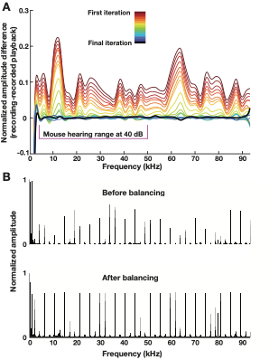

Using Psychtoolbox in matlab. This code is for interfacing with hires lab audio behavior designed by Phillip Maire. 
The script runs on a MBP and arduino to interface with a real time linux state machine, to play audio and light stimuli during neural recordings to study multisensory interaction in the cortex. 

##see narrated flow diagram video below

https://github.com/PhillipMaire/audio_behavior_realtime_playback/assets/19584564/4a34bc7a-9fc3-46b4-8650-0dc03f6fdb43

# Recording S2 neurons during a head-fixed object localization with audio playback
  
A) Whisker guided object localization task, example of go (hit) trial top, and a no-go (correct rejection) trial bottom. B) A still frame from 1000 fps video used to track whisker position, bending, and position derived variables. C) Extracted whisker position for a no-go (left) and go (right) trial. D) four trial outcomes from the task contingent on trial pole location and mouse licking during the answer period. E) modified audio task consisting of normal trials (left), sound only trials (right, bottom). For a subset (red) of trials a fake pole-down sound is played to allow a light-based trial start cue (right, middle), and a pole-up sound playback trial start cue (right, top). F) Intrinsic signal imaging of cortex while stimulating the C2 whisker. S1-C2 (centered) and S2 based on coordinates from S1-C2 G) E) Raster and trial type PSTH (bottom) of example neuron. H) Event PSTH of protraction touch, retraction touch, pole up sound, and pole down sound.

# Figure S3.2 Frequency balanced audio using iterative filter application 
## see "AutoParametricEQ" folder for scripts used to balance audio. 
  
A) Normalized amplitude difference from original audio and audio playback from before and after iterative frequency response balancing. B) Frequency response curve before (top) and after (bottom) balancing for beeping sounds at different frequencies.

Check out my website [DeepDataPhil.com](https://deepdataphil.com/)

This work was performed in [Dr. Samuel Andrew Hires lab](https://www.hireslab.org/). 

